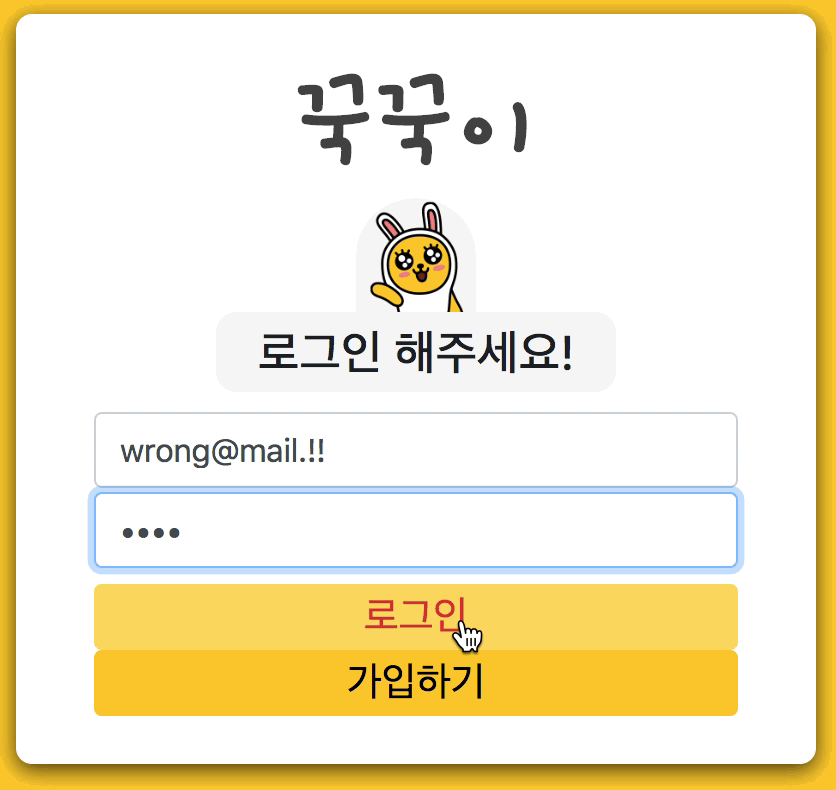
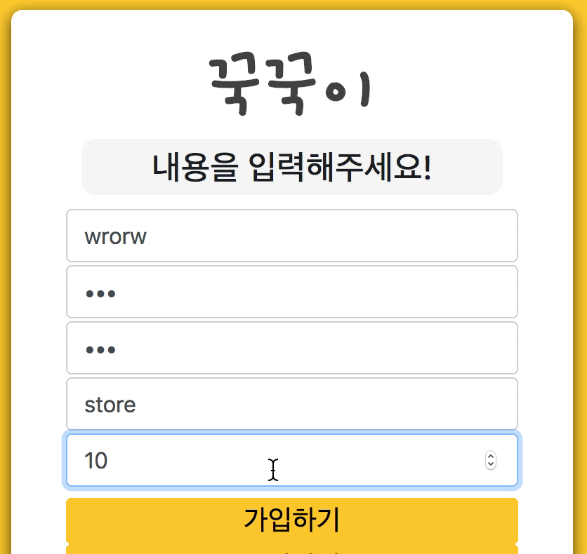

# 꾹꾹이

> 종이 쿠폰을 대체하는 간편한 스탬프 적립 플랫폼

### Web Client Repository

조금 더 선명한 시연 화면을 보고 싶으시다면 [이 곳](https://photos.app.goo.gl/ypWUiZnrW88crta27)을 참고해 주세요.

### **`회원 등록`**

새로운 손님의 전화번호를 입력받아 꾹꾹이 회원 DB에 등록합니다. 등록된 손님은 모든 꾹꾹이 가맹점에서 스탬프를 적립하고, 사용할 수 있습니다.

### **`회원 검색 / 스탬프 적립 및 사용`**

휴대폰 번호 뒷자리로 손님을 검색하고, 클릭 한 번으로 간편하게 스탬프를 적립할 수 있습니다. 음료 교환에 필요한 개수만큼 스탬프를 모았다면 모은 스탬프들을 사용할 수 있습니다.

스탬프 개수가 부족한 경우 별도의 창을 띄우지 않고 에러 메시지를 표현해 에러 창을 닫는데 드는 시간을 줄였습니다.

### **`사장님 로그인`**

매장 관리자의 로그인 기능입니다. 에러 메시지를 한 화면에 표현합니다.

### **`사장님 가입`**

신규 매장을 등록하며 관리자 유저가 가입하는 기능입니다. 올바른 입력인지 확인하고, 오류를 표현합니다.